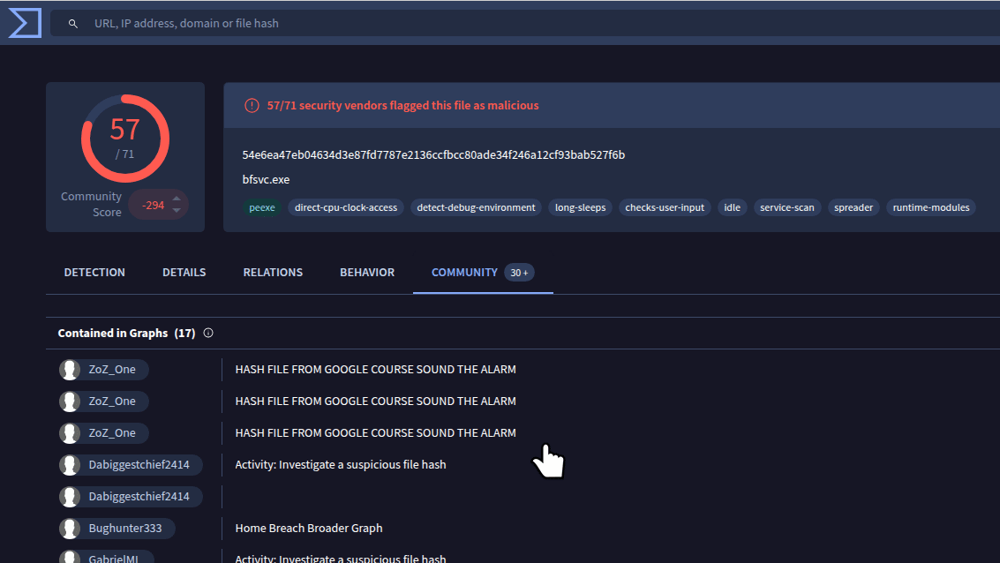
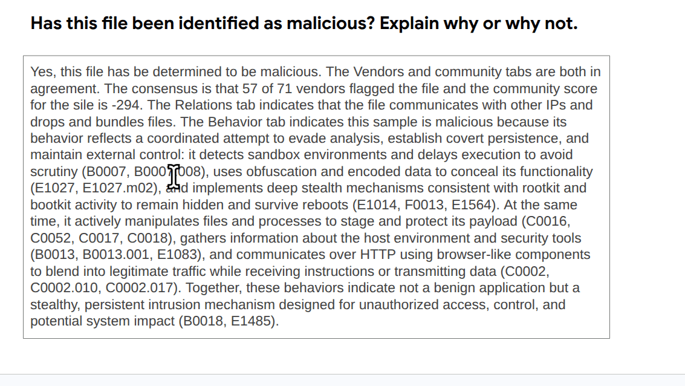
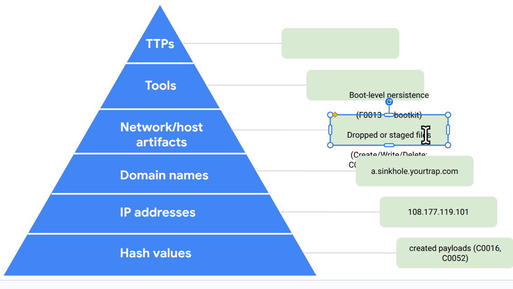

# 🗂️  Incident Journal

---

## 📋 Journal Entry

| Field | Details |
|-------|---------|
| **Date** | `2026-05-02` |
| **Entry #** | `002` |

---

### 📝 Description

> _An alert was generated when an employee opened a password protected spreadsheet, and entered a password provided in a phishing email. When the employee opened the file, a malicious payload was executed on the employee's computer. The incident triggered the IDS, which then alerted the SOC. I was assigned to the incident. _

---

### 🛠️ Tools Used

| Tool | Purpose |
|------|---------|
| `Virus Total ` | `Check the SHA256 file hash 54e6ea47eb... ` |

---

### 🔍 The 5 W's

**Who** caused the incident?
> An external threat actor delivered a malicious payload via a phishing email; the internal employee unknowingly triggered the execution._

**What** happened?
> A password-protected malicious spreadsheet attachment was delivered via email. After the employee opened it using the provided password, a hidden payload executed, resulting in the creation of multiple unauthorized executable files on the host and triggering an IDS alert._

**When** did it occur?
> - 1:11 p.m. (email received)
> - 1:13 p.m. (file opened/execution)
> - 1:15 p.m. (malicious file creation)
> - 1:20 p.m. (alert triggered)_

**Where** did it happen?
> On an employee’s workstation within the organization’s internal network environment._

**Why** did it happen?
> The attack succeeded due to social engineering (phishing) combined with a password-protected attachment, which likely bypassed email security controls and relied on user interaction to execute the malicious payload._

---

### 💬 Additional Notes

> - The use of a password-protected attachment suggests intentional evasion of email scanning tools.
> - The rapid timeline (≈7 minutes from delivery to detection) indicates automated or pre-staged payload execution.
> - The creation of multiple executables suggests a multi-stage infection or loader behavior, consistent with earlier analysis of the hash.
> - The SHA256 hash (54e6ea47...) should be used to pivot in threat intelligence platforms (e.g., VirusTotal) to identify related samples and infrastructure.
> - Recommend checking for:
> 	- persistence mechanisms
>	- outbound network connections
> 	- lateral movement indicators_

---
