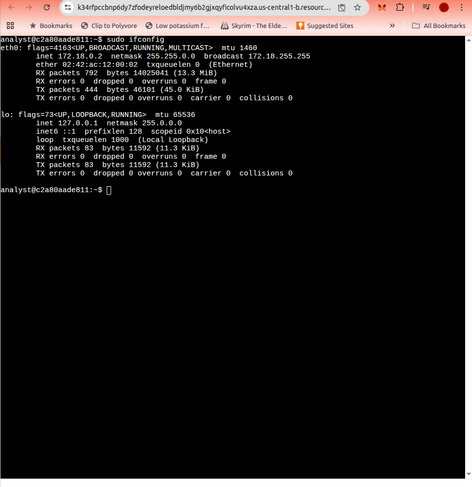
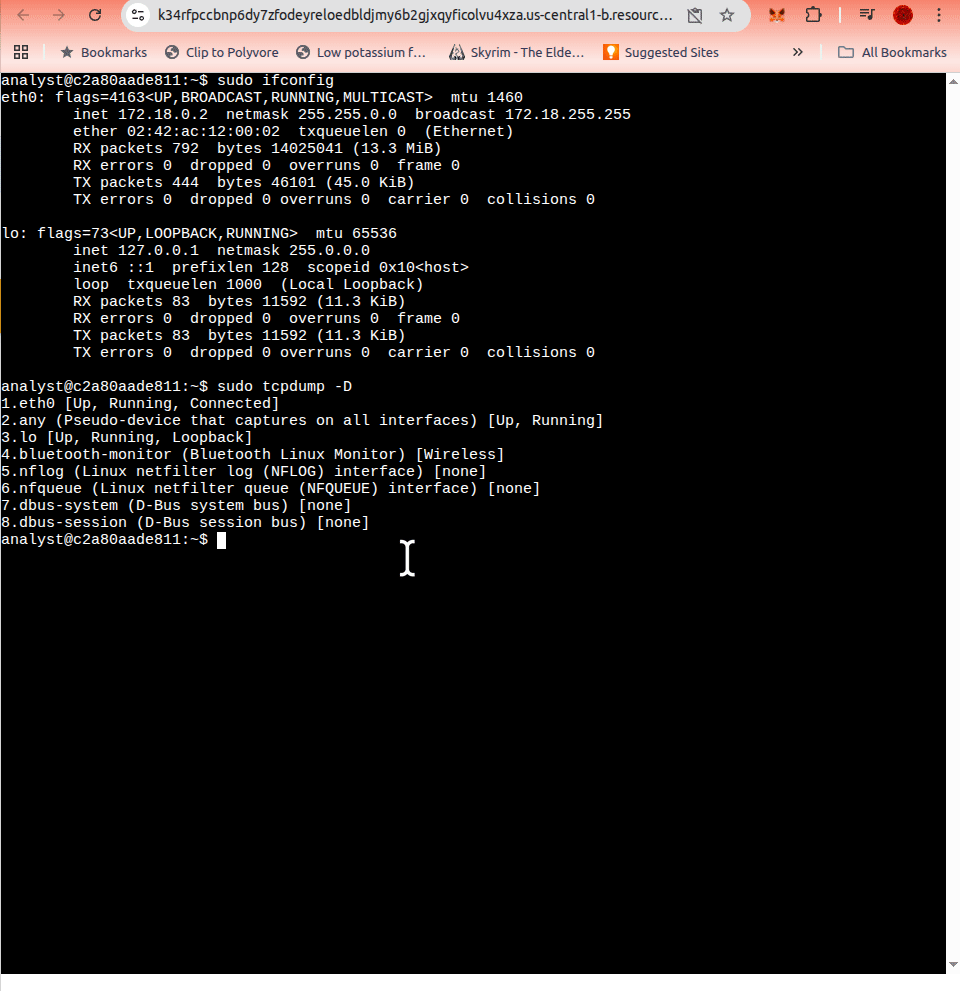
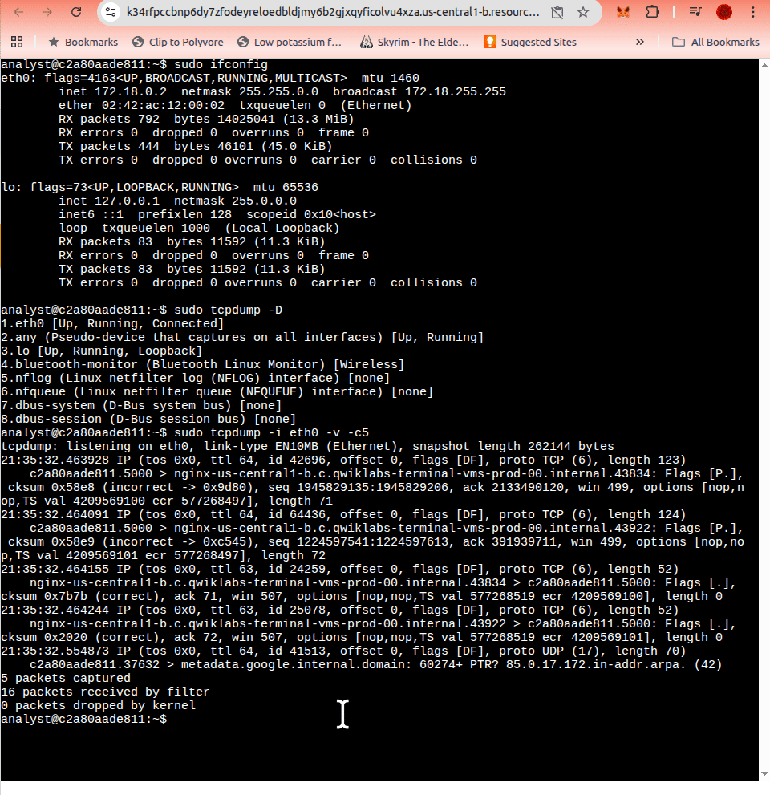
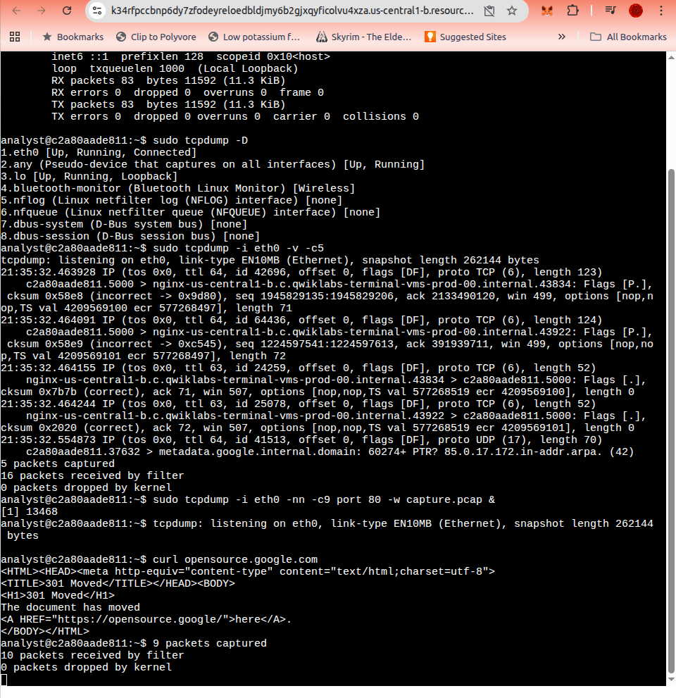
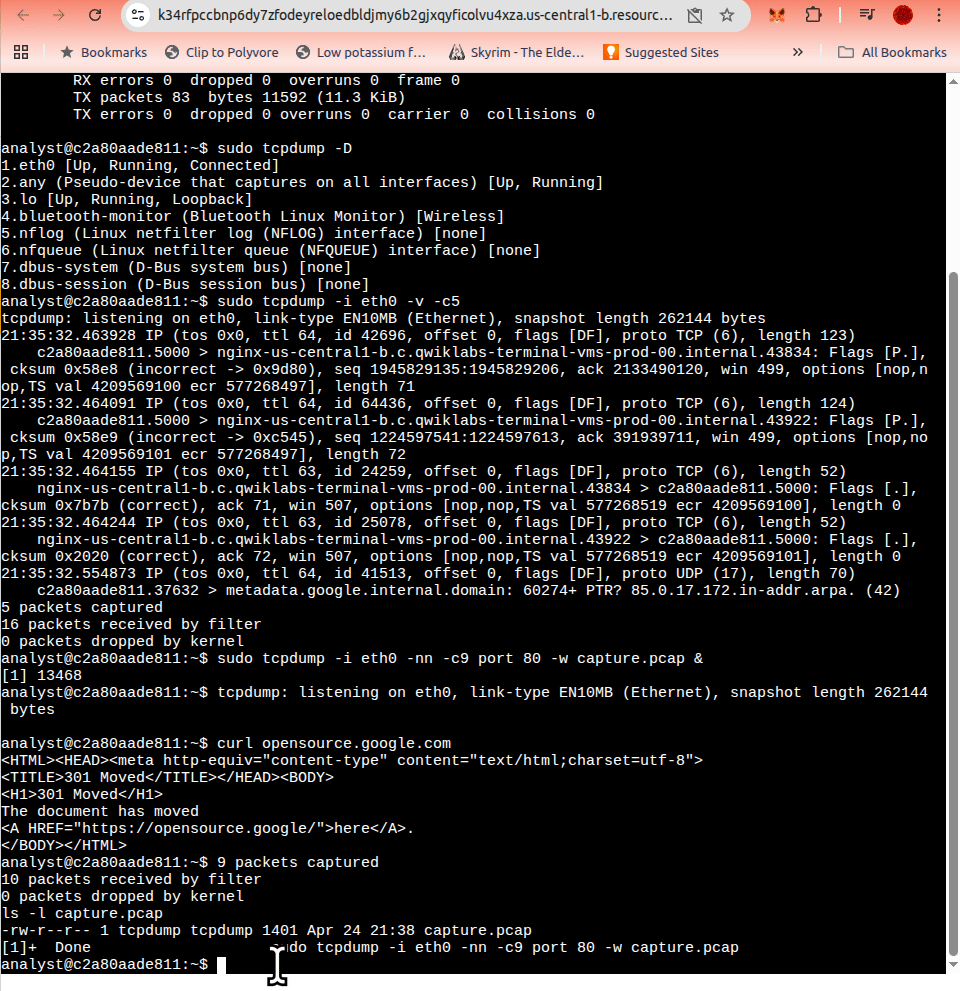

# Incident Journal

---

## Journal Entry

| Field | Details |
|-------|---------|
| **Date** | `2026-04-24` |
| **Entry #** | `005` |
| **Scenario** | Capturing and analyzing network traffic with tcpdump |

---

### Description

During this activity, network traffic was captured and analyzed using the `tcpdump` utility inside a Linux environment. The lab focused on identifying active network interfaces, capturing live packet traffic, filtering HTTP communications, saving packet captures into `.pcap` files, and reviewing captured packet contents using verbose and hexadecimal output modes.

The exercise demonstrated how security analysts inspect packet-level communications during network investigations and incident response workflows.

The activity also reinforced operational concepts related to:

- network interface identification,
- packet filtering,
- traffic inspection,
- HTTP communication analysis,
- packet capture storage,
- and forensic review of captured traffic.

Traffic was generated using `curl` requests and then analyzed using multiple `tcpdump` output modes, including verbose packet inspection and hexadecimal/ASCII rendering.

GIF recordings were captured throughout the exercise to document the workflow and preserve the packet analysis process visually.

---

### Activity GIFs

| GIF | Description |
|-----|-------------|
| [Interface Discovery](assets/tcpdump-interface-discovery.gif) | Initial interface discovery and tcpdump setup |
| [Live Packet Capture](assets/tcpdump-live-capture.gif) | Live packet capture using verbose output |
| [HTTP Traffic Capture](assets/tcpdump-http-traffic.gif) | HTTP traffic generation and packet recording |
| [PCAP Review](assets/tcpdump-pcap-review.gif) | Reviewing saved packet captures |
| [Hexadecimal Packet Analysis](assets/tcpdump-hex-analysis.gif) | Extended hexadecimal and ASCII packet analysis |

---

### Tools Used

| Tool | Purpose |
|------|---------|
| `tcpdump` | Captured and analyzed live network traffic |
| `ifconfig` | Identified active network interfaces |
| `curl` | Generated HTTP traffic for packet capture |
| `Linux Terminal` | Executed packet capture and filtering commands |
| `capture.pcap` | Stored captured packet data for later analysis |

---

### The 5 W's

**Who** caused the incident?
> N/A. This was a controlled lab activity rather than an incident caused by a threat actor.

**What** happened?
> Network traffic was generated, captured, filtered, saved, and reviewed using `tcpdump` to practice packet-level investigation techniques.

**When** did it occur?
> The activity took place on April 24, 2026.

**Where** did it happen?
> The activity was completed inside a Linux terminal environment using local packet capture tooling.

**Why** did it happen?
> The purpose was to practice packet capture and traffic analysis skills used in network troubleshooting, intrusion detection, malware analysis, and forensic investigations.

---

### Additional Notes

The activity demonstrated how packet captures can reveal detailed information about network communications, including:



- source and destination systems,
- transport protocols,
- packet lengths,
- TCP flags,
- sequence and acknowledgment numbers,
- checksums,
- and payload data.



The lab also demonstrated the importance of disabling hostname and port resolution during investigations using the `-nn` flag to reduce unnecessary network lookups and preserve operational security during packet analysis.



Verbose output (`-v`) provided additional packet metadata, while hexadecimal output (`-X`) exposed the raw packet contents for low-level analysis.



Packet capture data was saved into a `.pcap` file and later reviewed using offline analysis techniques.



---

### Key Commands Used

```bash
sudo ifconfig

sudo tcpdump -D

sudo tcpdump -i eth0 -v -c5

sudo tcpdump -i eth0 -nn -c9 port 80 -w capture.pcap &

curl opensource.google.com

ls -l capture.pcap

sudo tcpdump -nn -r capture.pcap -v

sudo tcpdump -nn -r capture.pcap -X
```

---

### Observations

Observed concepts included:

- identifying active interfaces with `ifconfig` and `tcpdump -D`,
- filtering traffic by interface and port,
- capturing limited packet counts for controlled analysis,
- generating HTTP traffic for inspection,
- saving packet captures into `.pcap` format,
- reviewing verbose packet headers,
- and examining hexadecimal packet contents.

The activity reinforced how packet capture tools support:

- network troubleshooting,
- intrusion detection,
- malware analysis,
- and forensic investigations.

---

### Reflections / Notes

**Were there any specific activities that were challenging for you? Why or why not?**
> This was a straightforward tool, but I am still trying to remember the syntax. I do not think it was challenging besides the memorization task.

**Has your understanding of incident detection and response changed since taking this course?**
> Considerably. I did not know how to use these tools until I took this course.

**Was there a specific tool or concept that you enjoyed the most? Why?**
> In this activity, I most enjoyed using `tcpdump` for a live capture.
